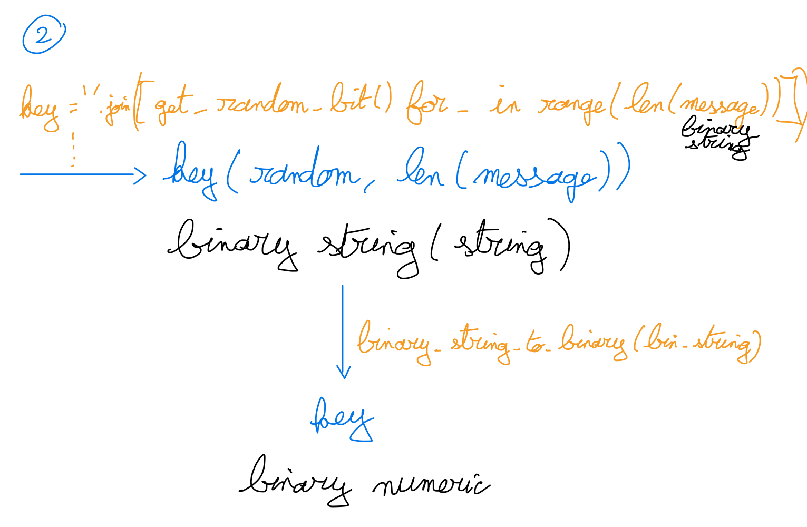

```text
Name: Benoît Clemenceau
GitHub username: ben-clem (https://github.com/ben-clem)
Collaborators: None
Extension: No
Sources:
```

---

<p align="center">
  
</p>

<h1 align="center">Lab 3: Code Cracking</h1>

## Part 0: Design (5 points)





